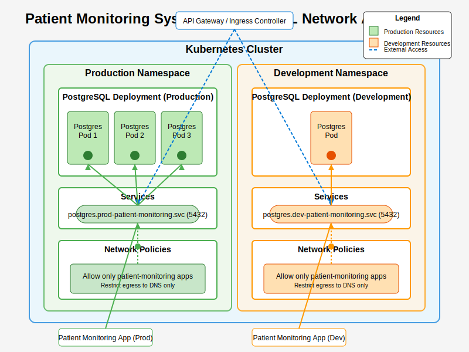

# PostgreSQL Deployment for Patient Monitoring System

## Overview

This repository contains Kubernetes manifests for deploying PostgreSQL as part of an NHS patient remote monitoring system. The deployment is designed to securely store telemetry data from wearable devices, following GitOps practices and implementing multiple security best practices.

## Architecture



The architecture follows a GitOps approach:
1. Developers push code changes to GitHub
2. GitHub Actions CI/CD pipeline is triggered
3. The pipeline validates and applies Kubernetes manifests
4. PostgreSQL is deployed in the Kubernetes cluster with proper security controls

## Security Considerations

This deployment implements several security best practices:

1. **Least privilege principle** via RBAC (Role-Based Access Control)
   - Custom roles and role bindings to limit permissions
   - Service accounts with minimal necessary permissions

2. **Network security** via Kubernetes NetworkPolicies
   - Restricts database access to only authorized services
   - Limits egress traffic to essential services (DNS)

3. **Secret management**
   - Development: Kustomize secret generation
   - Production: SealedSecrets for encrypted secrets in Git
   - No credentials stored in plain text

4. **Pod security context**
   - Non-root user execution
   - Read-only root filesystem
   - Dropped Linux capabilities
   - Resource limits to prevent DoS

## GitOps Implementation

The GitOps approach is implemented through:

1. **Source of truth in Git**
   - All configuration stored in version control
   - Changes tracked and auditable

2. **Declarative configuration**
   - Kustomize for environment-specific overlays
   - Kubernetes manifests define the desired state

3. **Automated deployment**
   - GitHub Actions for CI/CD pipeline
   - Automated testing and validation before deployment
   - Progressive delivery (dev → prod)

4. **Environment-specific configurations**
   - Development and production overlays
   - Different resource allocations and security configurations

## Deployment Instructions

To deploy this PostgreSQL instance:

1. Clone this repository
2. Set up Kubernetes cluster access
3. Deploy to development:
   ```bash
   kubectl apply -k overlays/dev
   ```
4. For production deployment:
   ```bash
   # First encrypt secrets using kubeseal
   kubeseal -f overlays/prod/postgres-secrets.yaml \
     -o yaml > overlays/prod/sealed-secrets/postgres-sealed-secrets.yaml
   
   # Then apply
   kubectl apply -k overlays/prod
   ```

## Future Enhancements

The current implementation could be extended with:

1. **High Availability**
   - Zalando PostgreSQL Operator for HA setup
   - Replication for disaster recovery

2. **Monitoring**
   - Prometheus metrics collection
   - Grafana dashboards for PostgreSQL metrics
   - Alerts for performance and health issues

3. **Backup & Recovery**
   - Automated backup procedures
   - Point-in-time recovery capability

4. **Data Encryption**
   - Transparent Data Encryption (TDE)
   - Encrypted communication (TLS)

## Trade-offs

Several trade-offs were made in this implementation:

1. **Simplicity vs. High-Availability**
   - Single PostgreSQL instance for simplicity
   - Could be enhanced with PostgreSQL operator for HA

2. **Manual vs. Automated Secret Rotation**
   - Static secrets for simplicity
   - Could implement automated rotation using a secrets manager

3. **Generic vs. Custom Storage Configuration**
   - Using standard storage class
   - Could be optimized with storage tuning for write-heavy telemetry data

4. **Development vs. Production Parity**
   - Dev uses simplified secret management
   - Production uses SealedSecrets for enhanced security

## Testing

The deployment can be validated using:

```bash
# Validate PostgreSQL deployment
kubectl get pods -n patient-monitoring

# Test connectivity (from within cluster)
kubectl run -n patient-monitoring postgres-client --rm --tty -i --restart='Never' \
  --image postgres:15.4 \
  --env="PGPASSWORD=$PASSWORD" \
  -- psql -h postgres -U postgres -d patient_telemetry
```


--------------------------------------------------------------------------------


# PostgreSQL Deployment for Patient Monitoring System

## Overview
This repository contains the Kubernetes manifests for deploying PostgreSQL as part of a patient remote monitoring system for an NHS Trust. The deployment is designed with security, scalability, and GitOps principles in mind.

## Architecture
The deployment follows a Kustomize-based approach with base configurations and environment-specific overlays:

- **Base**: Contains core Kubernetes resources (Deployment, Service, PVC, NetworkPolicy, RBAC)
- **Overlays**: Environment-specific configurations for development and production
  - **Dev**: Uses regular Kubernetes secrets for development
  - **Prod**: Uses SealedSecrets for secure secret management

## Security Considerations

1. **Network Policies**: Strict network policies limit database access to only authorized services.
2. **RBAC Implementation**: Role-Based Access Control ensures minimal privileges for service accounts.
3. **Sealed Secrets**: Production environments use Bitnami SealedSecrets to securely store credentials in Git.
4. **Resource Limits**: Defined resource limits prevent potential DoS scenarios.
5. **Pod Security Context**: Non-root user execution and filesystem restrictions.

## GitOps Approach
This deployment is designed to work with ArgoCD or Flux CD:

1. **Declarative Configuration**: All infrastructure is defined as code in this repository.
2. **Environment Separation**: Using Kustomize overlays for different environments.
3. **Automated Deployment**: GitHub Actions workflow included for CI/CD pipeline integration.
4. **Secret Management**: SealedSecrets ensure secure credential management within GitOps workflow.

## Getting Started

### Prerequisites
- Kubernetes cluster (1.19+)
- kubectl configured
- SealedSecrets controller (for production)
- Kustomize (v4.0+)

### Deployment

For development:
```bash
kubectl apply -k overlays/dev
```

For production:
```bash
kubectl apply -k overlays/prod
```

## Trade-offs and Considerations

1. **Stateful Application**: PostgreSQL is stateful, requiring careful consideration for upgrades and backups. This implementation uses a PVC, but for a production NHS system, additional backup and DR strategies would be needed.

2. **Secret Management**: While SealedSecrets provides security for Git-stored secrets, a full production system might benefit from integration with a dedicated secrets management solution like HashiCorp Vault.

3. **High Availability**: This implementation focuses on security and deployment fundamentals. A production system would need additional configuration for high availability with replication.

4. **Monitoring and Alerting**: For patient data, comprehensive monitoring should be implemented. This base deployment would be extended with Prometheus exporters and relevant alerts.

5. **Data Encryption**: This implementation includes TLS for data in transit. For NHS patient data, additional encryption for data at rest would be required.

## Future Enhancements

1. Implement PostgreSQL clustering for high availability
2. Add automated backup solution
3. Integrate with external secrets management
4. Add comprehensive monitoring with Prometheus
5. Implement data retention policies as required by NHS standards